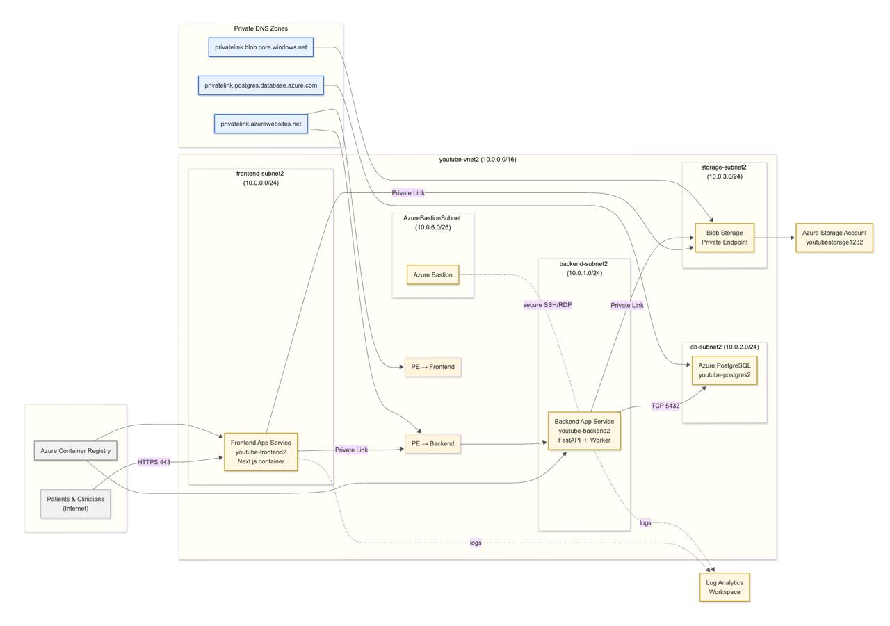

<!-- AZURE DOCUMENT PROCESSING APPLICATION -->
<div align="center">
  
# 🚀 Azure Document Processing Application
### Comprehensive Deployment Guide



</div>

<hr>

## 📋 Table of Contents

- [Environment Setup](#1-environment-setup)
- [Resource Group Creation](#2-create-resource-group)
- [Network Configuration](#3-setup-networking)
- [PostgreSQL Database](#4-create-postgresql-database)
- [Storage Account](#5-create-storage-account)
- [App Service & Web Apps](#6-create-app-service-plan-and-web-apps)
- [Container Registry & Identities](#7-create-container-registry-and-setup-identities)
- [Container Image Management](#8-build-and-push-container-images)
- [Web App Container Configuration](#9-configure-web-apps-to-use-containers)
- [Application Settings](#10-setup-app-settings)
- [Private Endpoints](#11-setup-private-endpoints-for-web-apps)
- [Azure Bastion](#12-setup-azure-bastion)
- [Logging Configuration](#13-configure-logging)
- [Troubleshooting & Fixes](#fixes)
- [Network Hardening](#vnet--subnet-hardening)
- [Management & Jumpbox](#management-subnet--jump-host-vm)

<hr>

## 1. Environment Setup

```bash
RESOURCE_GROUP="youtube-rg2"
LOCATION="westus"

# Networking
VNET_NAME="youtube-vnet2"
VNET_ADDRESS_SPACE="10.0.0.0/16"
FRONTEND_SUBNET_NAME="frontend-subnet2"
BACKEND_SUBNET_NAME="backend-subnet2"
DB_SUBNET_NAME="db-subnet2"
STORAGE_SUBNET_NAME="storage-subnet2"
FRONTEND_SUBNET_PREFIX="10.0.0.0/24"
BACKEND_SUBNET_PREFIX="10.0.1.0/24"
DB_SUBNET_PREFIX="10.0.2.0/24"
STORAGE_SUBNET_PREFIX="10.0.3.0/24"

# Database
POSTGRES_SERVER="youtube-postgres2"
POSTGRES_USER="adminuser"
POSTGRES_PASSWORD="mysecretpassword"
POSTGRES_DB="mydb"

# Storage
STORAGE_ACCOUNT_NAME="youtubestorage1232"
CONTAINER_NAME="youtubecontainer2"

# App Service
PLAN_NAME="youtube-plan2"
BACKEND_APP="youtube-backend2"
FRONTEND_APP="youtube-frontend2"

# Container Registry
ACR_NAME="youtubeacr1232"
ACR_LOGIN_SERVER="${ACR_NAME}.azurecr.io"

# Bastion
BAS_SUBNET_NAME="AzureBastionSubnet"  
BAS_SUBNET_PREFIX="10.0.6.0/26"
BAS_PIP_NAME="bastion-ip2"
BAS_HOST_NAME="youtube-bastion2"

# Private Endpoints
PE_SUBNET_NAME="pe-backend-subnet2"
PE_SUBNET_PREFIX="10.0.4.0/28"
PE_UI_SUBNET_NAME="pe-frontend-subnet2"
PE_UI_PREFIX="10.0.5.0/28"
```

<hr>

## 2. Create Resource Group

```bash
az group create --name $RESOURCE_GROUP --location $LOCATION
```

<hr>

## 3. Setup Networking

```bash
# Create VNET
az network vnet create \
  --name $VNET_NAME \
  --resource-group $RESOURCE_GROUP \
  --location $LOCATION \
  --address-prefix $VNET_ADDRESS_SPACE

# Create Frontend Subnet
az network vnet subnet create \
  --name $FRONTEND_SUBNET_NAME \
  --resource-group $RESOURCE_GROUP \
  --vnet-name $VNET_NAME \
  --address-prefix $FRONTEND_SUBNET_PREFIX \
  --service-endpoints Microsoft.Web

# Create Backend Subnet
az network vnet subnet create \
  --name $BACKEND_SUBNET_NAME \
  --resource-group $RESOURCE_GROUP \
  --vnet-name $VNET_NAME \
  --address-prefix $BACKEND_SUBNET_PREFIX \
  --service-endpoints Microsoft.Web

# Create Storage Subnet
az network vnet subnet create \
  --name $STORAGE_SUBNET_NAME \
  --resource-group $RESOURCE_GROUP \
  --vnet-name $VNET_NAME \
  --address-prefix $STORAGE_SUBNET_PREFIX \
  --service-endpoints Microsoft.Storage

# Create Private Endpoint Subnet for Backend
az network vnet subnet create \
  --resource-group $RESOURCE_GROUP \
  --vnet-name $VNET_NAME \
  --name $PE_SUBNET_NAME \
  --address-prefix $PE_SUBNET_PREFIX

az network vnet subnet update \
  --resource-group $RESOURCE_GROUP \
  --vnet-name $VNET_NAME \
  --name $PE_SUBNET_NAME \
  --private-endpoint-network-policies Disabled

# Create Private Endpoint Subnet for Frontend
az network vnet subnet create \
  --resource-group $RESOURCE_GROUP \
  --vnet-name $VNET_NAME \
  --name $PE_UI_SUBNET_NAME \
  --address-prefix $PE_UI_PREFIX

az network vnet subnet update \
  --resource-group $RESOURCE_GROUP \
  --vnet-name $VNET_NAME \
  --name $PE_UI_SUBNET_NAME \
  --private-endpoint-network-policies Disabled

# Create DB Subnet with proper delegation
az network vnet subnet create \
  --resource-group $RESOURCE_GROUP \
  --vnet-name $VNET_NAME \
  --name $DB_SUBNET_NAME \
  --address-prefixes $DB_SUBNET_PREFIX \
  --delegations "Microsoft.DBforPostgreSQL/flexibleServers"

# Get DB Subnet ID
DB_SUBNET_ID=$(az network vnet subnet show \
                 --resource-group $RESOURCE_GROUP \
                 --vnet-name $VNET_NAME \
                 --name $DB_SUBNET_NAME \
                 --query id -o tsv)
```

<hr>

## 4. Create PostgreSQL Database

```bash
az postgres flexible-server create \
  --name $POSTGRES_SERVER \
  --resource-group $RESOURCE_GROUP \
  --location $LOCATION \
  --admin-user $POSTGRES_USER \
  --admin-password $POSTGRES_PASSWORD \
  --sku-name Standard_D2s_v3 \
  --tier GeneralPurpose \
  --storage-size 128 \
  --version 16 \
  --subnet $DB_SUBNET_ID \
  --private-dns-zone "${POSTGRES_SERVER}-pdz.postgres.database.azure.com" \
  --high-availability Disabled \
  --yes

# Create DB
az postgres flexible-server db create \
  --resource-group $RESOURCE_GROUP \
  --server-name $POSTGRES_SERVER \
  --database-name $POSTGRES_DB
```

<hr>

## 5. Create Storage Account

```bash
az storage account create \
  --name $STORAGE_ACCOUNT_NAME \
  --resource-group $RESOURCE_GROUP \
  --location $LOCATION \
  --sku Standard_LRS \
  --kind StorageV2 \
  --https-only true \
  --min-tls-version TLS1_2 \
  --allow-blob-public-access false \
  --default-action Allow

# Add network rules
az storage account network-rule add \
  --resource-group $RESOURCE_GROUP \
  --account-name $STORAGE_ACCOUNT_NAME \
  --vnet-name $VNET_NAME \
  --subnet $STORAGE_SUBNET_NAME

# Create private DNS zone for blob storage
az network private-dns zone create \
  --resource-group $RESOURCE_GROUP \
  --name "privatelink.blob.core.windows.net"

# Link private DNS zone to VNET
az network private-dns link vnet create \
  --resource-group $RESOURCE_GROUP \
  --zone-name "privatelink.blob.core.windows.net" \
  --name "BlobPrivateDNSLink" \
  --virtual-network $VNET_NAME \
  --registration-enabled false

# Get Storage Account ID
STORAGE_ID=$(az storage account show \
               --name $STORAGE_ACCOUNT_NAME \
               --resource-group $RESOURCE_GROUP \
               --query id -o tsv)

# Create private endpoint for storage account
az network private-endpoint create \
  --name            "pe-${STORAGE_ACCOUNT_NAME}-blob" \
  --resource-group  "$RESOURCE_GROUP" \
  --vnet-name       "$VNET_NAME" \
  --subnet          "$STORAGE_SUBNET_NAME" \
  --private-connection-resource-id "$STORAGE_ID" \
  --group-id        blob \
  --connection-name "pe-${STORAGE_ACCOUNT_NAME}-conn" \
  --location        "$LOCATION"

# Create DNS zone group for storage
az network private-endpoint dns-zone-group create \
  --endpoint-name "pe-${STORAGE_ACCOUNT_NAME}-blob" \
  --name "zonegroup" \
  --resource-group $RESOURCE_GROUP \
  --private-dns-zone "privatelink.blob.core.windows.net" \
  --zone-name "privatelink.blob.core.windows.net"
```

<hr>

## 6. Create App Service Plan and Web Apps

```bash
# Create App Service Plan
az appservice plan create \
  --name $PLAN_NAME \
  --resource-group $RESOURCE_GROUP \
  --location $LOCATION \
  --sku P1V2 \
  --is-linux

# Create Backend Web App
az webapp create \
  --name $BACKEND_APP \
  --resource-group $RESOURCE_GROUP \
  --plan $PLAN_NAME \
  --runtime "PYTHON|3.11"

# Create Frontend Web App
az webapp create \
  --name $FRONTEND_APP \
  --resource-group $RESOURCE_GROUP \
  --plan $PLAN_NAME \
  --runtime "NODE|20-lts"

# Enable VNET Integration for Backend
az network vnet subnet update \
  --resource-group $RESOURCE_GROUP \
  --vnet-name $VNET_NAME \
  --name $BACKEND_SUBNET_NAME \
  --delegations Microsoft.Web/serverFarms

BACKEND_SUBNET_ID=$(az network vnet subnet show \
                      --resource-group $RESOURCE_GROUP \
                      --vnet-name $VNET_NAME \
                      --name $BACKEND_SUBNET_NAME \
                      --query id -o tsv)

az webapp vnet-integration add \
  --name $BACKEND_APP \
  --resource-group $RESOURCE_GROUP \
  --vnet $VNET_NAME \
  --subnet $BACKEND_SUBNET_ID

# Enable VNET Integration for Frontend
az network vnet subnet update \
  --resource-group $RESOURCE_GROUP \
  --vnet-name $VNET_NAME \
  --name $FRONTEND_SUBNET_NAME \
  --delegations Microsoft.Web/serverFarms

FRONTEND_SUBNET_ID=$(az network vnet subnet show \
                       --resource-group $RESOURCE_GROUP \
                       --vnet-name $VNET_NAME \
                       --name $FRONTEND_SUBNET_NAME \
                       --query id -o tsv)

az webapp vnet-integration add \
  --name $FRONTEND_APP \
  --resource-group $RESOURCE_GROUP \
  --vnet $VNET_NAME \
  --subnet $FRONTEND_SUBNET_ID
```

<hr>

## 7. Create Container Registry and Setup Identities

```bash
# Create Container Registry
az acr create \
  --name $ACR_NAME \
  --resource-group $RESOURCE_GROUP \
  --location $LOCATION \
  --sku Standard \
  --admin-enabled false

# Setup Backend Identity
az webapp identity assign \
  --name $BACKEND_APP \
  --resource-group $RESOURCE_GROUP

BACKEND_ID=$(az webapp show \
               -g $RESOURCE_GROUP -n $BACKEND_APP \
               --query identity.principalId -o tsv)

# Setup Frontend Identity
az webapp identity assign \
  --name $FRONTEND_APP \
  --resource-group $RESOURCE_GROUP

FRONTEND_ID=$(az webapp show \
                -g $RESOURCE_GROUP -n $FRONTEND_APP \
                --query identity.principalId -o tsv)

# Get ACR ID
ACR_ID=$(az acr show -n $ACR_NAME -g $RESOURCE_GROUP --query id -o tsv)

# Assign AcrPull role to Backend
az role assignment create \
  --assignee-object-id $BACKEND_ID \
  --assignee-principal-type ServicePrincipal \
  --role AcrPull \
  --scope $ACR_ID

# Assign AcrPull role to Frontend
az role assignment create \
  --assignee-object-id $FRONTEND_ID \
  --assignee-principal-type ServicePrincipal \
  --role AcrPull \
  --scope $ACR_ID

# Enable ACR managed identity for Backend
BACKEND_APP_ID=$(az webapp show -g $RESOURCE_GROUP -n $BACKEND_APP --query id -o tsv)
az resource update \
  --ids "${BACKEND_APP_ID}/config/web" \
  --set properties.acrUseManagedIdentityCreds=true

# Enable ACR managed identity for Frontend
FRONTEND_APP_ID=$(az webapp show -g $RESOURCE_GROUP -n $FRONTEND_APP --query id -o tsv)
az resource update \
  --ids "${FRONTEND_APP_ID}/config/web" \
  --set properties.acrUseManagedIdentityCreds=true
```

<hr>

## 8. Build and Push Container Images

```bash
# Log in to ACR
az acr login --name $ACR_NAME

# Build and push Backend Container
cd backend
docker buildx build \
  --platform linux/amd64 \
  -t ${ACR_LOGIN_SERVER}/backend:latest \
  --push .
cd ..

# Build and push Frontend Container
cd frontend
docker buildx build \
  --platform linux/amd64 \
  -t ${ACR_LOGIN_SERVER}/frontend:latest \
  --push .
cd ..
```

<hr>

## 9. Configure Web Apps to Use Containers

```bash
# Configure Backend Web App
az webapp config container set \
  --name $BACKEND_APP \
  --resource-group $RESOURCE_GROUP \
  --docker-custom-image-name ${ACR_LOGIN_SERVER}/backend:latest \
  --docker-registry-server-url https://${ACR_LOGIN_SERVER}

# Configure Frontend Web App
az webapp config container set \
  --name $FRONTEND_APP \
  --resource-group $RESOURCE_GROUP \
  --docker-custom-image-name ${ACR_LOGIN_SERVER}/frontend:latest \
  --docker-registry-server-url https://${ACR_LOGIN_SERVER}
```

<hr>

## 10. Setup App Settings

```bash
# Get Storage Key
STORAGE_KEY=$(az storage account keys list \
                --resource-group $RESOURCE_GROUP \
                --account-name $STORAGE_ACCOUNT_NAME \
                --query "[0].value" -o tsv)


# Construct the DATABASE_URL
DATABASE_URL="postgresql://${POSTGRES_USER}:${POSTGRES_PASSWORD}@${POSTGRES_SERVER}.postgres.database.azure.com:5432/${POSTGRES_DB}?sslmode=require"

# Set Backend App Settings
az webapp config appsettings set \
  --name "$BACKEND_APP" \
  --resource-group "$RESOURCE_GROUP" \
  --settings \
    POSTGRES_HOST="${POSTGRES_SERVER}.postgres.database.azure.com" \
    POSTGRES_DB="$POSTGRES_DB" \
    POSTGRES_USER="$POSTGRES_USER" \
    POSTGRES_PASSWORD="$POSTGRES_PASSWORD" \
    DATABASE_URL="$DATABASE_URL" \
    AZURE_STORAGE_ACCOUNT_NAME="$STORAGE_ACCOUNT_NAME" \
    AZURE_STORAGE_CONTAINER_NAME="$CONTAINER_NAME" \
    AZURE_STORAGE_ACCOUNT_KEY="$STORAGE_KEY" \
    WEBSITES_PORT="8000" \
    VNET_ROUTE_ALL_ENABLED="1"

# Print Backend settings for verification
echo "Backend App Settings:"
echo "POSTGRES_HOST: ${POSTGRES_SERVER}.postgres.database.azure.com"
echo "POSTGRES_DB: $POSTGRES_DB"
echo "POSTGRES_USER: $POSTGRES_USER"
echo "POSTGRES_PASSWORD: $POSTGRES_PASSWORD"
echo "DATABASE_URL: $DATABASE_URL"
echo "AZURE_STORAGE_ACCOUNT_NAME: $STORAGE_ACCOUNT_NAME"
echo "AZURE_STORAGE_CONTAINER_NAME: $CONTAINER_NAME"
echo "AZURE_STORAGE_ACCOUNT_KEY: $STORAGE_KEY"
echo "WEBSITES_PORT: 8000"
echo "VNET_ROUTE_ALL_ENABLED: 1"

# Set Frontend App Settings
az webapp config appsettings set \
  --name $FRONTEND_APP \
  --resource-group $RESOURCE_GROUP \
  --settings \
    AZURE_STORAGE_ACCOUNT_NAME="$STORAGE_ACCOUNT_NAME" \
    AZURE_STORAGE_CONTAINER_NAME="$CONTAINER_NAME" \
    AZURE_STORAGE_ACCOUNT_KEY="$STORAGE_KEY" \
    NEXT_PUBLIC_API_URL="https://${BACKEND_APP}.azurewebsites.net" \
    WEBSITES_PORT="3000" \
    VNET_ROUTE_ALL_ENABLED="1"

# Print Frontend settings for verification
echo "Frontend App Settings:"
echo "AZURE_STORAGE_ACCOUNT_NAME: $STORAGE_ACCOUNT_NAME"
echo "AZURE_STORAGE_CONTAINER_NAME: $CONTAINER_NAME"
echo "AZURE_STORAGE_ACCOUNT_KEY: $STORAGE_KEY"
echo "NEXT_PUBLIC_API_URL: https://${BACKEND_APP}.azurewebsites.net"
echo "WEBSITES_PORT: 3000"
echo "VNET_ROUTE_ALL_ENABLED: 1"
```

<hr>

## 11. Setup Private Endpoints for Web Apps

```bash
# Create private DNS zone for Web Apps
az network private-dns zone create \
  --resource-group $RESOURCE_GROUP \
  --name "privatelink.azurewebsites.net"

az network private-dns link vnet create \
  --resource-group $RESOURCE_GROUP \
  --zone-name "privatelink.azurewebsites.net" \
  --name WebsitesPrivateDNSLink \
  --virtual-network $VNET_NAME \
  --registration-enabled false

# Set Backend to deny public traffic
az webapp config access-restriction set \
  --name $BACKEND_APP \
  --resource-group $RESOURCE_GROUP \
  --default-action Deny \
  --use-same-restrictions-for-scm-site true

# Create Backend private endpoint
BACKEND_APP_ID=$(az webapp show \
                   --name $BACKEND_APP \
                   --resource-group $RESOURCE_GROUP \
                   --query id -o tsv)

PE_BACKEND_SUBNET_ID=$(az network vnet subnet show \
  --resource-group "$RESOURCE_GROUP" \
  --vnet-name      "$VNET_NAME" \
  --name           "$PE_SUBNET_NAME" \
  --query id -o tsv)

az network private-endpoint create \
  --name "pe-${BACKEND_APP}" \
  --resource-group $RESOURCE_GROUP \
  --subnet $PE_BACKEND_SUBNET_ID \
  --private-connection-resource-id $BACKEND_APP_ID \
  --group-id sites \
  --connection-name "pe-${BACKEND_APP}-conn" \
  --location $LOCATION

az network private-endpoint dns-zone-group create \
  --endpoint-name "pe-${BACKEND_APP}" \
  --name zonegroup \
  --resource-group $RESOURCE_GROUP \
  --private-dns-zone "privatelink.azurewebsites.net" \
  --zone-name "privatelink.azurewebsites.net"

# Create Frontend private endpoint
FRONTEND_APP_ID=$(az webapp show \
                    --name $FRONTEND_APP \
                    --resource-group $RESOURCE_GROUP \
                    --query id -o tsv)

PE_FRONTEND_SUBNET_ID=$(az network vnet subnet show \
  --resource-group "$RESOURCE_GROUP" \
  --vnet-name      "$VNET_NAME" \
  --name           "$PE_UI_SUBNET_NAME" \
  --query id -o tsv)

az network private-endpoint create \
  --name "pe-${FRONTEND_APP}" \
  --resource-group $RESOURCE_GROUP \
  --subnet $PE_FRONTEND_SUBNET_ID \
  --private-connection-resource-id $FRONTEND_APP_ID \
  --group-id sites \
  --connection-name "pe-${FRONTEND_APP}-conn" \
  --location $LOCATION

az network private-endpoint dns-zone-group create \
  --endpoint-name "pe-${FRONTEND_APP}" \
  --name zonegroup \
  --resource-group $RESOURCE_GROUP \
  --private-dns-zone "privatelink.azurewebsites.net" \
  --zone-name "privatelink.azurewebsites.net"

# Allow Backend to be accessed from Frontend subnet
az webapp config access-restriction add \
  --name $BACKEND_APP \
  --resource-group $RESOURCE_GROUP \
  --rule-name allow-frontend-vnet \
  --action Allow \
  --subnet $FRONTEND_SUBNET_ID \
  --priority 100
```

<hr>

## 12. Setup Azure Bastion

```bash
# Create Bastion subnet
az network vnet subnet create \
  --resource-group $RESOURCE_GROUP \
  --vnet-name $VNET_NAME \
  --name $BAS_SUBNET_NAME \
  --address-prefix $BAS_SUBNET_PREFIX

# Create public IP for Bastion
az network public-ip create \
  --resource-group $RESOURCE_GROUP \
  --name $BAS_PIP_NAME \
  --sku Standard \
  --allocation-method Static

# Create Bastion host
az network bastion create \
  --name $BAS_HOST_NAME \
  --resource-group $RESOURCE_GROUP \
  --vnet-name $VNET_NAME \
  --public-ip-address $BAS_PIP_NAME \
  --location $LOCATION \
  --sku Standard

# Enable tunneling for Bastion
az network bastion update \
  --resource-group $RESOURCE_GROUP \
  --name $BAS_HOST_NAME \
  --sku name=Standard \
  --enable-tunneling true
```

<hr>

## 13. Configure Logging

```bash
# Configure logging for both apps
for APP in $BACKEND_APP $FRONTEND_APP; do
  az webapp log config \
    --name $APP \
    --resource-group $RESOURCE_GROUP \
    --application-logging filesystem \
    --detailed-error-messages true \
    --failed-request-tracing true \
    --docker-container-logging filesystem \
    --level Information
done

# Build frontend with ARGs
docker buildx build --no-cache --platform linux/amd64 \
  --build-arg NEXT_PUBLIC_API_URL="https://${BACKEND_APP}.azurewebsites.net" \
  --build-arg AZURE_STORAGE_ACCOUNT_NAME="$STORAGE_ACCOUNT_NAME" \
  --build-arg AZURE_STORAGE_ACCOUNT_KEY="$STORAGE_KEY" \
  --build-arg AZURE_STORAGE_CONTAINER_NAME="$CONTAINER_NAME" \
  -t "${ACR_LOGIN_SERVER}/frontend:latest" \
  --push .


# Restart apps to apply all changes
az webapp restart -g $RESOURCE_GROUP -n $BACKEND_APP
az webapp restart -g $RESOURCE_GROUP -n $FRONTEND_APP
```

<hr>

## Fixes

```bash
az webapp config access-restriction set \
  --name "$FRONTEND_APP" \
  --resource-group "$RESOURCE_GROUP" \
  --default-action Allow


az webapp config access-restriction show \
  --name "$FRONTEND_APP" \
  --resource-group "$RESOURCE_GROUP" \
  --query ipSecurityRestrictions


az webapp config access-restriction remove \
  --name "$FRONTEND_APP" \
  --resource-group "$RESOURCE_GROUP" \
  --rule-name "DenyAll"


az webapp show \
  --name "$FRONTEND_APP" \
  --resource-group "$RESOURCE_GROUP" \
  --query publicNetworkAccess

az webapp update \
  --name "$FRONTEND_APP" \
  --resource-group "$RESOURCE_GROUP" \
  --set publicNetworkAccess=Enabled


az webapp restart -g "$RESOURCE_GROUP" -n "$FRONTEND_APP"
```

<hr>

## Front-end App Service

```bash
# 1. Check IP access restrictions
az webapp config access-restriction show \
  --name "$FRONTEND_APP" \
  --resource-group "$RESOURCE_GROUP" \
  --query ipSecurityRestrictions

# 2. Check whether public access is on
az webapp show \
  --name "$FRONTEND_APP" \
  --resource-group "$RESOURCE_GROUP" \
  --query publicNetworkAccess

# 3. Turn public access back ON
az webapp update \
  --name "$FRONTEND_APP" \
  --resource-group "$RESOURCE_GROUP" \
  --set publicNetworkAccess=Enabled

# 4. Restart the front-end to pick up the change
az webapp restart -g "$RESOURCE_GROUP" -n "$FRONTEND_APP"
```

<hr>

## VNet / Subnet Hardening

```bash
# 5. Add Service Endpoints to the front-end subnet
az network vnet subnet update \
  --resource-group "$RESOURCE_GROUP" \
  --vnet-name      "$VNET_NAME" \
  --name           "$FRONTEND_SUBNET_NAME" \
  --service-endpoints Microsoft.Web Microsoft.Storage

# 6. Allow that subnet to reach the Storage account
az storage account network-rule add \
  --resource-group "$RESOURCE_GROUP" \
  --account-name   "$STORAGE_ACCOUNT_NAME" \
  --vnet-name      "$VNET_NAME" \
  --subnet         "$FRONTEND_SUBNET_NAME"

# 7. Add Service Endpoints to the back-end subnet
az network vnet subnet update \
  --resource-group "$RESOURCE_GROUP" \
  --vnet-name      "$VNET_NAME" \
  --name           "$BACKEND_SUBNET_NAME" \
  --service-endpoints Microsoft.Web Microsoft.Storage

# 8. Allow the back-end subnet to reach the Storage account
az storage account network-rule add \
  --resource-group "$RESOURCE_GROUP" \
  --account-name   "$STORAGE_ACCOUNT_NAME" \
  --vnet-name      "$VNET_NAME" \
  --subnet         "$BACKEND_SUBNET_NAME"

# 9. Quick report: which subnets are allowed?
az storage account network-rule list \
  -g "$RESOURCE_GROUP" -n "$STORAGE_ACCOUNT_NAME" \
  --query "[].{subnet:id,action:action}" -o table

# 10. Slam the public door on the Storage account
az storage account update \
  --resource-group "$RESOURCE_GROUP" \
  --name           "$STORAGE_ACCOUNT_NAME" \
  --default-action Deny
```

<hr>

## Back-end App Service

```bash
# 11. Restart the back-end to adopt new network rules
az webapp restart -g "$RESOURCE_GROUP" -n "$BACKEND_APP"
```

<hr>

## Bastion Hardening & Tunnelling

```bash
# 12. Switch on Bastion "IP Connect" (required for private-IP tunnels)
az network bastion update \
  --name "$BAS_HOST_NAME" \
  --resource-group "$RESOURCE_GROUP" \
  --enable-ip-connect true
```

<hr>

## Management Subnet & Jump-host VM

```bash
# -- basic variables (example) --
 MGMT_SUBNET_NAME="mgmt-subnet2"
 MGMT_SUBNET_PREFIX="10.0.8.0/24"
 NSG_NAME="${MGMT_SUBNET_NAME}-nsg"
 VM_NAME="log-admin-vm"
 NIC_NAME="${VM_NAME}-nic"
 VM_SIZE="Standard_B2s"

# 13. Create an NSG for the management subnet
az network nsg create \
  --resource-group "$RESOURCE_GROUP" \
  --name           "$NSG_NAME" \
  --location       "$LOCATION"

# 14. Let anything inside the VNet SSH to anything else (port 22)
az network nsg rule create \
  --resource-group "$RESOURCE_GROUP" \
  --nsg-name       "$NSG_NAME" \
  --name           allow-ssh-from-vnet \
  --priority       100 \
  --access         Allow \
  --direction      Inbound \
  --protocol       Tcp \
  --source-address-prefixes VirtualNetwork \
  --destination-port-ranges 22

# 15. Carve out the mgmt subnet and attach the NSG
az network vnet subnet create \
  --resource-group "$RESOURCE_GROUP" \
  --vnet-name      "$VNET_NAME" \
  --name           "$MGMT_SUBNET_NAME" \
  --address-prefixes "$MGMT_SUBNET_PREFIX" \
  --network-security-group "$NSG_NAME"

# 16. Sanity-check: show the new subnet's CIDR
az network vnet subnet show \
  --resource-group "$RESOURCE_GROUP" \
  --vnet-name      "$VNET_NAME" \
  --name           "$MGMT_SUBNET_NAME" \
  --query "{name:name, prefix:addressPrefix}"

# 17. Private NIC for the jump host
az network nic create \
  --resource-group "$RESOURCE_GROUP" \
  --name           "$NIC_NAME" \
  --vnet-name      "$VNET_NAME" \
  --subnet         "$MGMT_SUBNET_NAME"

# 18. Deploy the jump-host VM (no public IP)
az vm create \
  --resource-group "$RESOURCE_GROUP" \
  --name           "$VM_NAME" \
  --nics           "$NIC_NAME" \
  --image          Ubuntu2204 \
  --size           "$VM_SIZE" \
  --admin-username azureuser \
  --generate-ssh-keys \
  --public-ip-address ""

# 19. SSH into the VM through Bastion
az network bastion ssh \
  --name "$BAS_HOST_NAME" \
  --resource-group "$RESOURCE_GROUP" \
  --target-resource-id $(az vm show -g "$RESOURCE_GROUP" -n "$VM_NAME" --query id -o tsv) \
  --username azureuser \
  --ssh-key "$HOME/.ssh/id_rsa" \
  --auth-type ssh-key
```

<hr>

## Inside the Jump Host: Install Azure CLI

```bash
# 20. Add Microsoft's signing key
curl -sL https://packages.microsoft.com/keys/microsoft.asc | \
  sudo gpg --dearmor -o /usr/share/keyrings/microsoft.gpg

# 21. Add the Azure CLI APT repo
AZ_REPO=$(lsb_release -cs)
echo "deb [arch=amd64 signed-by=/usr/share/keyrings/microsoft.gpg] \
https://packages.microsoft.com/repos/azure-cli/ $AZ_REPO main" | \
  sudo tee /etc/apt/sources.list.d/azure-cli.list > /dev/null

# 22. Install the CLI
sudo apt update && sudo apt install -y azure-cli

# 23. Tail back-end logs live
az webapp log tail -g "$RESOURCE_GROUP" -n "$BACKEND_APP"
```# youtube_deploy_hipaa
# youtube_deploy_hipaa
